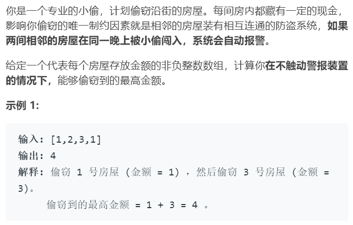

# 打家劫舍

### 题目来源

https://leetcode-cn.com/problems/house-robber/


### 题目描述



### 思路

状态转移方程为：`f(n)=max(f(n-2)+h[n],f(n-1))`。打劫n号房屋的情况和不打劫n号房屋的情况获取金额的最大值。


### 代码

```java
class Solution {
    public int rob(int[] nums) {
        int n = nums.length;
        if(n==0) return 0;
        if(n==1) return nums[0];
        int[] memos = new int[n];
        memos[0] = nums[0];
        memos[1] = Math.max(nums[0],nums[1]);
        for(int i=2; i<n; i++){
            memos[i] = Math.max(memos[i-1],memos[i-2]+nums[i]);
        } 
        return memos[n-1];
    }
}
```

