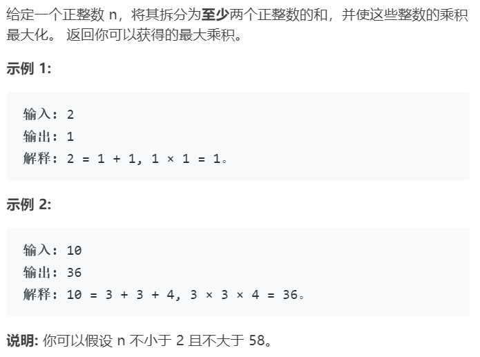

# 整数拆分

### 题目来源

https://leetcode-cn.com/problems/integer-break/

### 题目描述



### 思路

递归树如下：


可以先得出一个状态转移方程为：`f(n)=max(i*f(n-i)),i=1,2,...n-1`

然而这个方程是不完善的，不完善之处在于每一次拆分时都没有考虑`n-i`这一部分不在进行拆分的情况，例如：将4拆成`1+3`，这里计算时使用的是`1*f(3)`，而`f(3)`的最大值是2，如果直接将`1*f(3)`作为结果，便是没有考虑到3不拆分的情况，所以这里应该再考虑一个`i*(n-i)`的情况。

所以正确的状态转移方程应该是：`f(n)=max(i*f(n-i),i*(n-i)),i=1,2,...n-1`


### 代码

```java
class Solution {
    public int integerBreak(int n) {
        int[] memos = new int[n+1];
        memos[1] = 1;
        for(int i=2; i<=n; i++){
            memos[i] = i-1;
            for(int j=1; j<i; j++){ //找max
                memos[i] = max3(memos[i],j*memos[i-j],j*(i-j));
            }
        }
        return memos[n];
    }

    private int max3(int a, int b, int c){
        return Math.max(c,Math.max(a,b));
    }
}
```

